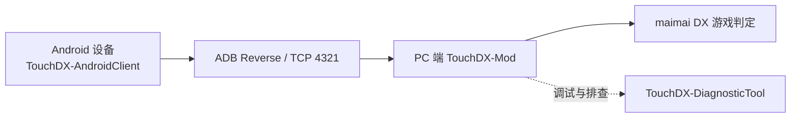

<h1 align="center">TouchDX</h1>

<p align="center">
  <strong>把 Android 平板 / 手机变成 maimai DX 的原生级触控外设</strong>
</p>

<p align="center">
  基于 Android 触控层、ADB 有线转发与 PC 端 Mod 注入的低延迟桥接方案。
</p>

<p align="center">
  <a href="https://github.com/YubaiNya/TouchDX/blob/main/LICENSE">
    
  </a>
  <a href="https://github.com/YubaiNya/TouchDX-AndroidClient/releases">
    
  </a>
  <a href="https://github.com/YubaiNya/TouchDX-Mod/releases">
    
  </a>
  <a href="https://github.com/YubaiNya/TouchDX/issues">
    
  </a>
</p>

<p align="center">
  <a href="#-快速开始">快速开始</a> ·
  <a href="#-文档导览">文档导览</a> ·
  <a href="https://github.com/YubaiNya/TouchDX-AndroidClient/releases">安卓客户端下载</a> ·
  <a href="https://github.com/YubaiNya/TouchDX-Mod/releases">PC Mod 下载</a> ·
  <a href="https://github.com/YubaiNya/TouchDX/issues">问题反馈</a>
</p>

> [!CAUTION]
> **请勿在官方机台、未经授权的公共场所或任何可能违反当地法律法规和游戏服务条款的环境中使用本项目。TouchDX 仅供个人学习、技术研究与体验验证。**

## ✨ 项目亮点

- **原生触控体验**：绕开 Windows 默认手势与系统级触控干扰，还原更接近街机面板的操作方式。
- **低延迟链路**：推荐使用 **ADB 有线转发**，让触控数据以极短路径回到 PC 游戏端。
- **完整生态**：覆盖安卓触控端、PC 注入端、诊断工具与配套文档。
- **可调可校准**：支持布局缩放、透明度、触摸半径、触摸锁定等细节调节。

## 📖 TouchDX 是什么

对于 PC 端音游玩家，尤其是游玩 **maimai DX（舞萌 DX）** 时，普通触摸屏设备常会受到 Windows 手势、系统焦点切换和多点触控兼容性的影响，导致误触、丢判甚至游戏最小化。

**TouchDX** 的思路不是“让 Windows 更懂触摸”，而是把 **Android 设备直接变成独立触控外设**：

1. 在 Android 端采集纯净的多点触控与外部按键状态。
2. 通过 **ADB reverse** 建立低延迟本地转发通道。
3. 由 PC 端 Mod 将输入直接桥接到游戏内部判定逻辑。

这意味着你看到的是串流画面，而真正负责输入的是 TouchDX 的悬浮触控层。

## ⚠️ 关于画面串流

> [!IMPORTANT]
> **TouchDX 只负责“触摸判定与输入转发”，不会采集或传输任何游戏画面。**

若你希望在平板 / 手机上看到 PC 端游戏画面，需要自行搭配串流方案。推荐使用 **[Moonlight](https://moonlight-stream.org/)** 获得更低的画面延迟与更稳定的体验。

推荐使用流程：

1. 启动 Moonlight，把 PC 画面串流到安卓设备。
2. 返回安卓桌面，打开 TouchDX 客户端并连接到 PC。
3. 让 TouchDX 悬浮触控层覆盖在串流画面上完成操作。

## 🧩 组件架构



| 组件 | 作用 | 说明 |
| --- | --- | --- |
| [TouchDX-AndroidClient](https://github.com/YubaiNya/TouchDX-AndroidClient) | 安卓触控端 | 捕获多点触控、按键映射与悬浮层交互 |
| [TouchDX-Mod](https://github.com/YubaiNya/TouchDX-Mod) | PC 注入端 | 接收输入并桥接到游戏内部逻辑 |
| [TouchDX-DiagnosticTool](https://github.com/YubaiNya/TouchDX-DiagnosticTool) | PC 诊断工具 | 连接前排查转发、网络、掩码与状态同步问题 |
| [`/docs`](./docs) | 文档目录 | 包含原理讲解、安装教程与通信协议说明 |
| [`/Release`](./Release) | 发布附件 | 当前仓库附带的 APK、DLL 与诊断工具压缩包 |

## 🚀 快速开始

### 1. 准备 PC 环境

1. 安装 [Android Platform Tools (ADB)](https://developer.android.com/studio/releases/platform-tools)。
2. 先安装 **MelonLoader**，再将 **[TouchDX-Mod](https://github.com/YubaiNya/TouchDX-Mod/releases)** 的 `.dll` 放入游戏的 `Package\Mods` 目录。
3. 使用数据线连接安卓设备，并开启 **USB 调试**。
4. 在终端执行：

   ```bash
   adb reverse tcp:4321 tcp:4321
   ```

### 2. 配置 Android 设备

1. 从 **[TouchDX-AndroidClient Releases](https://github.com/YubaiNya/TouchDX-AndroidClient/releases)** 下载并安装 APK。
2. 打开 App，将连接地址设置为：

   ```text
   127.0.0.1
   ```

3. 点击“连接”，等待提示成功。

### 3. 开始游玩

1. 启动游戏，等待 Mod 自动接管输入。
2. 在安卓设备上完成拍打、滑动与按键操作。
3. 享受不受 Windows 手势干扰的触控体验。

## 📚 文档导览

<details>
<summary><strong>01 - 项目基础介绍</strong></summary>

- [TouchDX 诞生背景与解决痛点](./docs/01-项目基础介绍/01-TouchDX诞生背景与解决痛点.md)
- [分布式架构与系统工作原理](./docs/01-项目基础介绍/02-分布式架构与系统工作原理.md)
- [常见问题与术语解答](./docs/01-项目基础介绍/03-常见问题与术语解答.md)

</details>

<details>
<summary><strong>02 - 用户使用指南</strong></summary>

- [安卓客户端安装与详细设置](./docs/02-用户使用指南/04-安卓客户端安装与详细设置.md)
- [PC 端 Mod 与游戏环境配置](./docs/02-用户使用指南/05-PC端Mod与游戏环境配置.md)
- [ADB 有线转发高级配置教程](./docs/02-用户使用指南/06-ADB有线转发高级配置教程.md)
- [使用诊断工具排查网络故障](./docs/02-用户使用指南/07-使用诊断工具排查网络故障.md)

</details>

<details>
<summary><strong>03 - 安卓端技术剖析</strong></summary>

- [原生 View 与多点触控生命周期](./docs/03-安卓端技术剖析/08-原生View与多点触控生命周期.md)
- [SVG 高精度解析与异形判定算法](./docs/03-安卓端技术剖析/09-SVG高精度解析与异形判定算法.md)
- [智能状态切换：打歌与选歌的博弈](./docs/03-安卓端技术剖析/10-智能状态切换：打歌与选歌的博弈.md)
- [悬浮窗 Overlay 架构与 UI 交互设计](./docs/03-安卓端技术剖析/11-悬浮窗Overlay架构与UI交互设计.md)

</details>

<details>
<summary><strong>04 - 网络层与通信协议</strong></summary>

- [64 位输入掩码与二进制传输协议](./docs/04-网络层与通信协议/12-64位输入掩码与二进制传输协议.md)
- [TCP 非阻塞 NIO 与 1ms 高频发包机制](./docs/04-网络层与通信协议/13-TCP非阻塞NIO与1ms高频发包机制.md)
- [心跳包同步与诊断 Ping 测试实现](./docs/04-网络层与通信协议/14-心跳包同步与诊断Ping测试实现.md)

</details>

<details>
<summary><strong>05 - PC 端注入技术揭秘</strong></summary>

- [MelonLoader 框架与 Harmony 钩子技术](./docs/05-PC端注入技术揭秘/15-MelonLoader框架与Harmony钩子技术.md)
- [系统 API 硬件键盘模拟与内存写入逻辑](./docs/05-PC端注入技术揭秘/16-系统API硬件键盘模拟与内存写入逻辑.md)

</details>

## 🚨 问题反馈

> [!IMPORTANT]
> 请将 **TouchDX 主仓库、安卓端、PC Mod、诊断工具** 的 Bug 反馈与功能建议统一提交到本仓库的 [Issues 页面](https://github.com/YubaiNya/TouchDX/issues)，方便集中追踪与处理。

如果你在子仓库单独提 Issue，开发者可能无法第一时间看到。

## 💖 赞助与支持

如果 TouchDX 改善了你的打歌体验，欢迎通过 **爱发电** 支持作者持续更新：

<p align="center">
  <a href="https://ifdian.net/a/YubaiNya">
    
  </a>
</p>

## 🤝 参与贡献

欢迎通过以下方式参与改进 TouchDX：

- 提交 Issue，反馈体验问题与使用场景。
- 提交 Pull Request，改进文档、功能或性能表现。
- 优化触控布局、校准体验与可视化资源。

## 📜 开源许可

本项目及其相关分支组件均基于 [AGPL-3.0](./LICENSE) 开源。

> [!WARNING]
> **免责声明**：本项目仅供技术交流与学习，严禁用于任何商业牟利及非法用途；对于因使用本项目造成的账号封禁、数据损坏或其他损失，作者不承担责任。
